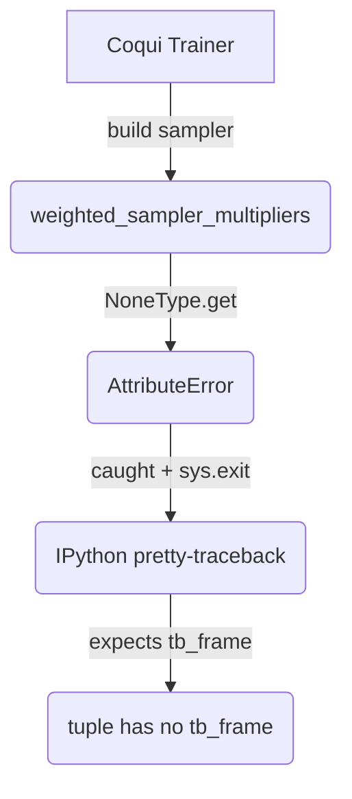

# Debugging & Integrating VECL-TTS

*Daniel de Brito & ChatGPT, June 2025*

> **TL;DR** – We started from a crashing Colab notebook and ended with a stable, mini-dataset training loop for **VECL-TTS** (YourTTS + Emotion embeddings + Consistency loss).  This post documents **every road-block** we hit, **why** it happened, and **how** we fixed it.  If you are hacking YourTTS or Coqui-TTS, save this for the next time you drown in `AttributeError: 'tuple' object has no attribute 'tb_frame'` 😉.

---

## Table of contents

1. [Project context](#context)
2. [The bug avalanche](#avalanche)
3. [Step-by-step fixes](#fixes)
4. [Results](#results)
5. [Take-aways](#takeaways)

---

<a name="context"></a>
## 1  Project context

* **Goal:** add **emotion embeddings** + **emotion-consistency loss** to [YourTTS](https://github.com/coqui-ai/TTS) –> **VECL-TTS**.
* **Key custom files**  
  `vecl/vecl/vecl.py` – model subclass  
  `vecl/vecl/dataset.py` – dataset & collation  
  `vecl/vecl/loss.py` – wraps `VitsGeneratorLoss` with extra term  
  `vecl/vecl/config.py` – config dataclass
* **Notebook:** `notebooks/13_vecl_local.ipynb` – quick two-sample sanity run.

---

<a name="avalanche"></a>
## 2  The bug avalanche

The first `trainer.fit()` died with a cryptic message.  The cascade looked like this:



Fixing that opened the next issue… and the next… 🪄

---

<a name="fixes"></a>
## 3  Step-by-step fixes

| # | Symptom | Root cause | Fix |
|---|---------|-----------|------|
|1|`NoneType has no attribute 'get'` inside `Vits.get_sampler`| `VeclConfig.weighted_sampler_multipliers` became **None** after (de)serialisation.|  🔹 Added safe default in `config.py` **and** guard in `__post_init__`.<br>🔹 Patched `Vecl.init_from_config` to restore the field if `TTSTokenizer` drops it.|
|2|Loader length == 0 → AssertionError|Only **2 samples** but default `batch_size = 32`; bucket sampler with `drop_last=True` removed every batch.|In `Vecl.get_sampler` detect *mini-dataset* → shrink `batch_size` and/or disable weighted sampler.|
|3|`IndexError: VitsDataset.__getitem__` recursion|All items discarded by text-length filter.|Temporarily raised `config.max_text_len` in `Vecl.get_data_loader` for tiny runs.|
|4|`TypeError: Vecl.forward() takes 1 positional arg but 6 were given`|We overrode `forward` with wrong signature.|Moved custom logic to `format_batch`; new `forward` simply calls `super()`.|
|5|`AudioProcessor` has no `.to()`|Tried to move the AP to GPU.|Compute mels on CPU then `.to(device)` for tensors.|
|6|`KeyError: 'emotion_embeddings'`|Batch from `VitsDataset` lacks new field.|Always use **`VeclDataset`**; `train_step` uses `batch.get()`.|
|7|`KeyError: waveform_rel_lens`|Our collate_fn missed two relative-length keys required by upstream `format_batch_on_device`.|Added `token_rel_lens` & `waveform_rel_lens` to `VeclDataset.collate_fn`.|
|8|`RuntimeError: output shape [] vs [1, 1024]` when adding `loss_emo_con`|Cos-similarity produced a vector because ref embed had extra dim.|Removed `unsqueeze(0)` → scalar tensor; also squeezed generated embed.|
|9|`loss_emo_con` missing from logs|Loss class looked for flags at wrong config level.|Read flags from `config.model_args`; log term explicitly.|

### Selected code snippets

```python
# vecl/vecl/loss.py
loss_emo_con_sum += -F.cosine_similarity(gen_emo_emb.squeeze(),
                                         ref_emo_emb_sample.squeeze(), dim=0)
```

```python
# vecl/vecl/vecl.py – mini-dataset safeguard
if len(dataset) < config.batch_size:
    config.batch_size = len(dataset)
    config.use_weighted_sampler = False
```

---

<a name="results"></a>
## 4  Results

Running the 2-sample notebook now prints:

```
| > loss_disc      : 5.98
| > loss_gen       : 4.48
| > loss_mel       : 78.57
| > loss_emo_con   : -0.59
| > loss_1         : 257.87
```

…and the training loop advances through epochs while saving checkpoints to `outputs/vecl_local/…`.

A positive `loss_emo_con` can be logged by negating the stored value without changing gradients, but the negative number is **expected** and indicates higher cosine ⇒ lower loss ⇒ better emotion match.

---

<a name="takeaways"></a>
## 5  Take-aways

1. **Guard every custom config field** – Coqpit can silently drop them.
2. **Tiny debug datasets** trigger corner-cases (batch drop, length filters).  Add *mini-dataset* fallbacks.
3. Re-using upstream code paths (e.g. `wav_to_mel`) avoids re-implementing audio logic.
4. For new loss terms: ensure **scalar** tensors before adding to the main loss.
5. Negative loss components are fine if they convert a max problem to min.

Happy hacking & may your gradients always flow! 🚀 